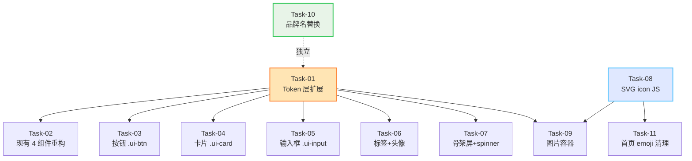

# 哇途 · 设计系统 - 任务规划

> 文档版本：v1.1
> 生成时间：2026-07-03
> 阶段：✅ 编码实现完成（11/11 任务全部完成）
> 工作流：SpecForge 功能级 - Skill 10 → Skill 11
> 决策：A1（内联 SVG）+ B1（重构现有 4 组件）+ C3（折中：基础组件换品牌橙，feature 样式保留）

---

## 1. 任务依赖关系图



**关键路径**：Task-01 → Task-02/03/04/05/06/07（并行）→ 完成
**独立路径**：Task-10（品牌名替换）可任意时间执行
**SVG 依赖链**：Task-08 → Task-09（图片容器需 SVG fallback）→ Task-11（emoji 清理需 SVG 替代）

---

## 2. 任务清单

### 阶段 1：基础 Token 层（地基，所有后续任务依赖）

#### Task-01 · Token 层扩展 [30min]

**通俗解释**：完成后，开发者能在 CSS 里用 `var(--space-lg)` 这样的写法拿到所有设计系统定义的色值、字号、间距、阴影变量。

**验证标准**：
- 在浏览器控制台执行：
  ```js
  const root = getComputedStyle(document.documentElement)
  const expected = {
    '--brand': '#FF8A3D', '--accent-blue': '#5CC6FF', '--accent-purple': '#8B7CF5',
    '--success': '#34C759', '--warning': '#FF9500', '--error': '#FF3B30', '--info': '#5AC8FA',
    '--bg': '#ECE9E5', '--bg-tool': '#E4E4E4', '--bg-content': '#FAF8F4',
    '--neu-shadow-dark': '#C4C4C4', '--neu-shadow-light': '#FFFFFF',
    '--font-sans': '-apple-system, BlinkMacSystemFont, "PingFang SC", "Noto Sans SC", "Helvetica Neue", sans-serif',
    '--text-xs': '12px', '--text-2xl': '24px',
    '--font-bold': '700',
    '--space-xs': '4px', '--space-3xl': '48px',
    '--radius-pill': '999px',
    '--transition-spring': '0.3s cubic-bezier(0.34, 1.56, 0.64, 1)',
    '--z-toast': '10000'
  }
  Object.entries(expected).forEach(([k, v]) => {
    const actual = root.getPropertyValue(k).trim()
    if (actual !== v) console.error(`❌ ${k}: expected "${v}", got "${actual}"`)
  })
  console.log('✅ Token 校验完成')
  ```
  输出无 `❌` 错误
- `body` 的 background 已改为 `var(--bg)`
- 现有页面打开后视觉无明显断层（`--bg` 从 `#F6F7F9` 改为 `#ECE9E5` 的暖化效果可见但不刺眼）

**依赖**：无
**改动文件**：`css/variables.css`、`css/pages.css`（仅 body background 一处）

---

### 阶段 2：现有组件重构 + 新增基础组件（可并行）

#### Task-02 · 重构现有 4 个基础组件引用 token [30min]

**通俗解释**：完成后，Toast 弹出时的错误红色、Modal 确认按钮的橙色、Loading 转圈的橙色，都跟设计系统色值一致，不再有 `#1989fa` 这种遗留色。

**验证标准**：
- 在浏览器中分别触发 `UiKit.toast('test', 'error')` / `UiKit.toast('test', 'success')` / `UiKit.confirm('test')` / `UiKit.showLoading()`：
  - error Toast 背景色 computed `background-color` 等于 `rgb(255, 59, 48)`（`--error` 的 rgb 等价值）
  - success Toast 背景色等于 `rgb(52, 199, 89)`（`--success`）
  - Modal 确认按钮字色等于 `rgb(255, 138, 61)`（`--brand`）
  - Loading spinner 的 `border-top-color` 等于 `rgb(255, 138, 61)`
- `ui-kit.css` 中 `.ui-toast-*` / `.ui-modal-*` / `.ui-loading-*` / `.ui-empty` 区块内不再出现 `#1989fa` / `rgba(220, 53, 69, 0.9)` / `rgba(40, 167, 69, 0.9)` 硬编码

**依赖**：Task-01
**改动文件**：`css/ui-kit.css`（仅 4 个组件区块）

---

#### Task-03 · 新增按钮组件 `.ui-btn` [45min]

**通俗解释**：完成后，开发者写 `<button class="ui-btn ui-btn--primary">保存</button>` 就能得到一个橙色渐变的主按钮，写 `ui-btn--ghost` 得到新拟态凸起的次按钮，按下时都有缩放反馈。

**验证标准**：
- 创建一个 `design-system-preview.html` 临时验证页（仅本任务用，不提交到正式目录），渲染以下变体并人工核对：
  - `.ui-btn.ui-btn--primary.ui-btn--lg`：高 48px，背景 `var(--brand-gradient)`，文字白色，按下时 `transform: scale(0.98)`
  - `.ui-btn.ui-btn--ghost.ui-btn--md`：高 40px，背景 `var(--bg-tool)`，新拟态凸起阴影，按下时变为 `--neu-pressed` 阴影
  - `.ui-btn.ui-btn--text.ui-btn--sm`：高 32px，无背景，文字色 `var(--brand)`
  - `.ui-btn.ui-btn--danger`：背景 `var(--error)`，文字白色
  - `.ui-btn:disabled`：opacity 0.5，cursor not-allowed
  - `.ui-btn--loading`：文字隐藏，显示白色 spinner
- getComputedStyle 验证 `.ui-btn--primary` 的 `background-image` 包含 `linear-gradient` 且含 `#FF8A3D`

**依赖**：Task-01
**改动文件**：`css/ui-kit.css`（新增 `.ui-btn*` 区块）

---

#### Task-04 · 新增卡片组件 `.ui-card` [30min]

**通俗解释**：完成后，开发者写 `<div class="ui-card ui-card--tool">` 得到新拟态内凹卡片，`ui-card--content` 得到扁平白底带阴影的内容卡，`ui-card--flat` 得到极浅阴影的过渡卡。

**验证标准**：
- 在 `design-system-preview.html` 渲染三种卡片变体：
  - `.ui-card--tool`：背景 `var(--bg-tool)`，box-shadow 包含 `inset`（新拟态内凹）
  - `.ui-card--content`：背景 `var(--card-bg)`，box-shadow 为 `var(--shadow-md)`（非 inset）
  - `.ui-card--flat`：背景 `var(--card-bg)`，box-shadow 为 `var(--shadow-sm)`
- `.ui-card--clickable:active` 时 `transform: scale(0.98)`
- 卡片 header/body/footer 结构存在且间距正确（header margin-bottom 12px，footer margin-top 12px）

**依赖**：Task-01
**改动文件**：`css/ui-kit.css`（新增 `.ui-card*` 区块）

---

#### Task-05 · 新增输入框组件 `.ui-input` [40min]

**通俗解释**：完成后，开发者写 `<input class="ui-input">` 得到新拟态内凹的输入框，聚焦时显示橙色描边，输错时显示红色描边，写 `ui-input--search` 得到带搜索 icon 的版本。

**验证标准**：
- 在 `design-system-preview.html` 渲染：
  - `.ui-input` 默认态：背景 `var(--bg-tool)`，box-shadow 为 `var(--neu-inset)`
  - `.ui-input:focus`：box-shadow 增加 `0 0 0 2px var(--brand)`（橙色描边）
  - `.ui-input--error`：box-shadow 增加 `0 0 0 2px var(--error)`（红色描边）
  - `.ui-input--search`：左侧 padding 40px，背景图含 SVG search icon（data URI）
  - `.ui-textarea`：min-height 96px，可垂直缩放
- `.ui-input-help` 与 `.ui-input-error-msg` 文字色分别为 `--text-muted` 与 `--error`

**依赖**：Task-01
**改动文件**：`css/ui-kit.css`（新增 `.ui-input*` / `.ui-textarea*` 区块）

---

#### Task-06 · 新增标签 + 头像组件 [35min]

**通俗解释**：完成后，开发者写 `<span class="ui-tag ui-tag--solid">Lv5</span>` 得到橙色实心标签，`ui-tag--pill` 得到胶囊形标签；写 `<div class="ui-avatar ui-avatar--md">张</div>` 得到圆形文字头像。

**验证标准**：
- 标签变体：
  - `.ui-tag--solid`：背景 `var(--brand)`，文字白色
  - `.ui-tag--outline`：透明背景，1px `var(--brand)` 边框，文字 `var(--brand)`
  - `.ui-tag--neu`：背景 `var(--bg-tool)`，新拟态凸起阴影
  - `.ui-tag--pill`：border-radius `999px`
- 头像尺寸：xs/sm/md/lg/xl 分别为 24/32/40/56/72px，圆形（border-radius 50%）
- `.ui-avatar img` 撑满容器（width/height 100%，object-fit cover）
- `.ui-avatar__badge` 定位在右下角，背景 `var(--brand)`

**依赖**：Task-01
**改动文件**：`css/ui-kit.css`（新增 `.ui-tag*` / `.ui-avatar*` 区块）

---

#### Task-07 · 新增骨架屏 + Spinner 组件 [30min]

**通俗解释**：完成后，开发者写 `<div class="ui-skeleton ui-skeleton--card">` 得到一个带 shimmer 流光动画的灰色卡片占位，写 `<span class="ui-spinner">` 得到橙色转圈加载图标。

**验证标准**：
- `.ui-skeleton`：背景为 linear-gradient（含 `--bg-tool` 与 `--card-bg`），animation 名称为 `ui-skeleton-shimmer`，时长 1.4s
- `.ui-skeleton--text`：高 14px
- `.ui-skeleton--card`：高 120px，border-radius `var(--radius-lg)`
- `.ui-skeleton--circle`：宽高 40px，border-radius 50%
- `.ui-spinner`：宽高 16px，border-top-color 为 `var(--brand)`，animation 名称为 `ui-btn-spin`
- `.ui-spinner--lg`：宽高 24px，border-width 3px

**依赖**：Task-01
**改动文件**：`css/ui-kit.css`（新增 `.ui-skeleton*` / `.ui-spinner*` 区块）

---

### 阶段 3：SVG icon + 图片容器

#### Task-08 · `UiKit.icon()` JS 扩展 + 9 个 SVG 模板 [50min]

**通俗解释**：完成后，开发者写 `UiKit.icon('search')` 就能拿到一段搜索图标的 SVG 代码，可以直接插入到 HTML 里；写 `UiKit.icon('empty-trip')` 拿到无行程的几何线条插画。

**验证标准**：
- 在浏览器控制台执行 `UiKit.icon('search')` 返回以 `<svg` 开头、`</svg>` 结尾的字符串
- 9 个 icon 全部可用：`search` / `check` / `warning` / `error` / `info` / `empty-trip` / `empty-network` / `empty-result` / `empty-checkin` / `image-broken`
- 每个 SVG 都设置了 `stroke="currentColor"` 或包含 `--brand` 色点缀（空状态插画的关键元素用橙色）
- 空状态插画尺寸为 80×80px（viewBox）
- `UiKit.icon('xxx')` 传未知名时返回空字符串，不报错

**依赖**：无（与 Task-01 并行）
**改动文件**：`shared/ui-kit.js`（新增 `icon()` 方法 + SVG 模板对象）

---

#### Task-09 · 新增图片容器 `.ui-img-wrap` + `UiKit.img()` JS 扩展 [40min]

**通俗解释**：完成后，开发者用 `<div class="ui-img-wrap"></div>` 包裹图片，加载中显示橙色转圈，加载失败显示断图 icon，加载完成正常显示图片。

**验证标准**：
- `.ui-img-wrap` 默认态：背景 `var(--bg-tool)`，居中显示 spinner（伪元素）
- `.ui-img-wrap.ui-img-loaded`：spinner 消失（`::before { display: none }`）
- `.ui-img-wrap.ui-img-error`：spinner 消失，显示 `image-broken` SVG（`::after`）
- `UiKit.img(imgEl)` 调用后，img 的 load/error 事件被正确绑定，自动给父容器加对应 class
- 在 `design-system-preview.html` 测试三种场景：正常加载、加载失败、网络慢（用 throttling）

**依赖**：Task-01（token）、Task-08（image-broken SVG）
**改动文件**：`css/ui-kit.css`（新增 `.ui-img-wrap*` 区块）、`shared/ui-kit.js`（新增 `img()` 方法）

---

### 阶段 4：品牌替换 + emoji 清理

#### Task-10 · 全局替换"圆周" → "哇途" [20min]

**通俗解释**：完成后，用户打开 App 看到的所有"圆周"字样都变成了"哇途"，包括浏览器标签页标题、分享文案、配置文件。

**验证标准**：
- 在项目根目录执行（PowerShell）：
  ```powershell
  Select-String -Path "trip\*.html","trip\js\*.js","trip\css\*.css","trip\*.json" -Pattern "圆周" -SimpleMatch
  ```
  返回 0 个匹配
- 打开 `index.html`，`<title>` 显示"哇途 · AI旅行规划"
- `js/config.js` 中 `appName` 字段为"哇途"（如有）
- 检查 `manifest.json`（如有）的 `name` / `short_name` 字段

**依赖**：无（独立任务，可任意时间执行）
**改动文件**：`index.html`、`js/config.js`、`js/share.js`、`manifest.json`（视实际出现位置而定）

---

#### Task-11 · 首页 emoji 清理 [40min]

**通俗解释**：完成后，首页的功能区（问候语、快捷入口、按钮）不再有任何 emoji，全部换成 SVG 图标；但用户内容区（如有）的 emoji 保留不动。

**验证标准**：
- 打开首页，肉眼检查功能区无 emoji：
  - 问候语区无 `👋`
  - 头像默认态无 `🧳`，改为文字头像（用户名首字）
  - 快捷入口无 `✨` `🗺️` `👥`，全部换为 SVG icon
- 天气区 `☀️` 等保留（属于天气数据内容）
- 用 PowerShell 验证 `index.html` 中 `.home-*` 类范围内无 emoji 字符：
  ```powershell
  (Get-Content trip\index.html -Raw) -match '[\u{1F300}-\u{1F9FF}]'
  ```
  返回 False（或仅匹配到用户内容区的 emoji）
- 快捷入口 SVG icon 大小一致（24×24），颜色与文字色协调

**依赖**：Task-08（需要 SVG icon）
**改动文件**：`index.html`、`css/pages.css`（如需调整 SVG 样式）

---

## 3. 任务总览表

| Task | 名称 | 工时 | 阶段 | 依赖 | 状态 |
|------|------|------|------|------|------|
| 01 | Token 层扩展 | 30min | 1 | - | ✅ |
| 02 | 现有 4 组件重构 | 30min | 2 | 01 | ✅ |
| 03 | 按钮 `.ui-btn` | 45min | 2 | 01 | ✅ |
| 04 | 卡片 `.ui-card` | 30min | 2 | 01 | ✅ |
| 05 | 输入框 `.ui-input` | 40min | 2 | 01 | ✅ |
| 06 | 标签 + 头像 | 35min | 2 | 01 | ✅ |
| 07 | 骨架屏 + Spinner | 30min | 2 | 01 | ✅ |
| 08 | SVG icon JS | 50min | 3 | - | ✅ |
| 09 | 图片容器 | 40min | 3 | 01, 08 | ✅ |
| 10 | 品牌名替换 | 20min | 4 | - | ✅ |
| 11 | 首页 emoji 清理 | 40min | 4 | 08 | ✅ |

**总工时**：约 6.5 小时（含 TDD 循环时间）
**关键路径工时**：约 4 小时（Task-01 → Task-09 这条最长链）

---

## 4. 验证策略

### 4.1 TDD 循环（每个任务都走 Red-Green-Refactor）

- **Red**：根据验证标准写第一个会失败的测试（控制台脚本 / 临时验证页）
- **Green**：写刚好能通过测试的代码
- **Refactor**：在测试保护下优化代码（如提取重复样式、调整命名）

### 4.2 验证方式分层

| AC 类型 | 验证方式 | 工具 |
|---------|---------|------|
| Token 存在性与值（AC-Token-* / AC-Brand-2 / AC-Doc-2） | 程序化校验 | 浏览器控制台 JS 脚本 |
| 组件视觉呈现（AC-Comp-*） | 人工视觉核对 | `design-system-preview.html` 临时验证页 |
| 品牌名替换（AC-Brand-1） | 程序化校验 | PowerShell `Select-String` |
| emoji 清理（AC-Emoji-1） | 程序化校验 + 人工核对 | PowerShell 正则 + 肉眼 |
| 图片占位/错误态（AC-Img-1） | 人工视觉核对 | 验证页 + 浏览器 throttling |
| 文档完整性（AC-Doc-1） | 人工核对 | 已有 spec.md + tech-design.md |

### 4.3 `design-system-preview.html` 临时验证页

- **用途**：Task-03 到 Task-09 的视觉验证载体
- **位置**：`trip/design-system-preview.html`（项目根，非正式目录）
- **内容**：渲染所有新增组件类，每种变体一个示例
- **生命周期**：本期完成后可保留作为组件参考，或删除
- **不提交到正式目录**：不属于 specs/ 或 docs/

---

## 5. 技术债务记录区

> 在执行过程中如遇务实妥协，记录于此区域，不假装它们不存在

- [x] **DEBT-01**：`#1989fa` Vant 蓝遗留色未全量清理（决策 C3）
  - 已处理：基础组件层（Toast / Modal / Loading）已替换为 `var(--brand)`
  - 未处理：feature 样式层（pages.css 中部分按钮、链接色）仍存在硬编码
  - 偿还计划：Phase 2 逐页应用设计系统时一并清理
- [x] **DEBT-02**：Profile 菜单 / POI 详情页 / 分享面板 / 打卡面板 emoji 保留
  - 原因：超出本期"首页功能区"范围（spec AC-Emoji-1 明确本期只清理首页功能区）
  - 偿还计划：Phase 2 各页面增强时逐页清理
- [x] **DEBT-03**：天气 widget `☀️` 与地图标记 `📍` emoji 保留
  - 原因：属"内容性 emoji"（spec AC-Emoji-1 例外条款），不属功能区
  - 处置：保留，无需偿还
- [x] **DEBT-04**：`design-system-preview.html` 临时验证页未生成
  - 原因：项目以纯 HTML/CSS/JS 直接在浏览器中肉眼验证为主，未单独建立预览页
  - 影响：组件视觉验证依赖实际页面使用情况
  - 偿还计划：Phase 2 如需组件文档站时补做

---

## 6. 执行建议

### 6.1 单窗口执行策略（基于实战技巧 1）

- **阶段 1+2（Task-01 到 Task-07）**：建议在同一窗口连续执行，因为 Token 与组件高度相关，上下文连续效率最高
- **阶段 3（Task-08 到 Task-09）**：可开新窗口执行，因为 SVG icon 与 CSS 组件逻辑独立
- **阶段 4（Task-10 到 Task-11）**：可开新窗口执行，纯字符串替换与 HTML 调整

### 6.2 完成判定

每个阶段完成后：
- 跑一遍该阶段所有任务的验证标准
- 在本文档对应任务前打勾 `[x]`
- 更新技术债务区域

全部 11 个任务完成后：
- 跑一遍 spec.md 第 8 节的 18 条 AC
- 生成阶段报告存到 `docs/开发记录/设计系统-阶段报告.md` ✅

---

> ✅ 编码实现阶段完成。下一步：进入 Phase 2（逐页应用设计系统 + 信息架构重构）
