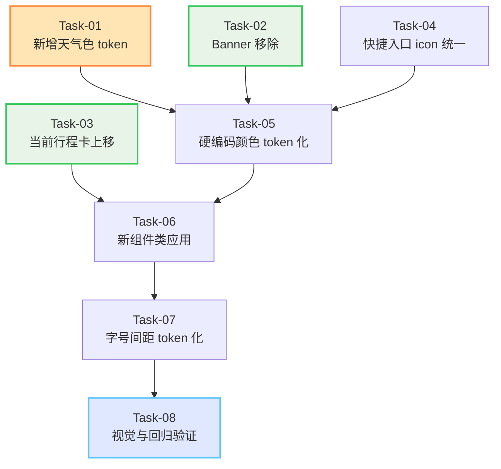

# 哇途 · 首页应用设计系统 - 任务规划

> 文档版本：v1.0
> 生成时间：2026-07-03
> 阶段：任务规划完成 / 待编码实现
> 工作流：SpecForge 功能级 - Skill 10

---

## 1. 任务依赖关系图



**关键路径**：Task-01 → Task-05 → Task-06 → Task-07 → Task-08
**可并行**：Task-02 / Task-03 / Task-04 三个独立改动可并行执行

---

## 2. 任务清单

### 阶段 1：独立改动（可并行）

#### Task-01 · 新增天气色 token [10min]

**通俗解释**：完成后，CSS 里能用 `var(--weather-blue)` 拿到天气蓝颜色，方便后续统一调整。

**验证标准**：
- 在浏览器控制台执行：
  ```js
  const root = getComputedStyle(document.documentElement)
  const expected = {
    '--weather-blue': '#4A90D9',
    '--weather-blue-dark': '#357ABD',
    '--weather-blue-light': '#A8E0FF',
    '--shadow-weather': '0 4px 16px rgba(74,144,217,0.3)'
  }
  Object.entries(expected).forEach(([k, v]) => {
    const actual = root.getPropertyValue(k).trim()
    if (actual !== v) console.error(`❌ ${k}: expected "${v}", got "${actual}"`)
  })
  ```
  输出无 `❌` 错误
- token 位于 `/* === 状态色 === */` 区块之后的 `/* === 天气色 === */` 区块内

**依赖**：无
**改动文件**：`css/variables.css`

---

#### Task-02 · Banner 移除 [10min]

**通俗解释**：完成后，首页底部不再显示"发现精彩旅程"横幅，相关 CSS 也一并清理。

**验证标准**：
- `index.html` 中无 `<div class="home-banner">` 元素
- `pages.css` 中无 `.home-banner` / `.banner-title` / `.banner-desc` / `.banner-emoji` / `.banner-content` 选择器
- 用 Grep 校验：
  ```
  pattern: home-banner|banner-title|banner-desc|banner-emoji|banner-content
  path: index.html, pages.css
  ```
  返回 0 匹配

**依赖**：无
**改动文件**：`index.html`、`css/pages.css`

---

#### Task-03 · 当前行程卡上移 [10min]

**通俗解释**：完成后，当前行程卡（机票样式）显示在旅行统计卡正下方，无行程时该区域不占位。

**验证标准**：
- `index.html` 中 `<div class="current-trip-card">` 元素位于 `</div>`（travel-stats-card 结尾）之后、`<div class="weather-widget">` 之前
- DOM 顺序：home-header → travel-stats-card → current-trip-card → weather-widget → quick-actions → quick-tools-section
- `current-trip-card` 的 `style="display:none;"` 保持，仅 JS 控制显示
- 类名与 ID 不变（`id="homeCurrentTripCard"` 保留）

**依赖**：无
**改动文件**：`index.html`

---

#### Task-04 · 快捷入口 icon 统一品牌色 [10min]

**通俗解释**：完成后，4 个快捷入口的圆形 icon 背景都变成统一的橙色渐变，仅靠 SVG 图形区分功能。

**验证标准**：
- `index.html` 中 4 个 `.qa-icon` 元素均无 `style="background:..."` 内联样式
- `pages.css` 中 `.qa-icon` 选择器包含 `background: var(--brand-gradient);`
- 浏览器中检查 4 个 `.qa-icon` 的 computed `background-image` 均为 `linear-gradient(135deg, #FFA35C 0%, #FF8A3D 50%, #FF7020 100%)`
- 4 个 SVG icon 的 `stroke="#fff"` 保持白色

**依赖**：无
**改动文件**：`index.html`、`css/pages.css`

---

### 阶段 2：批量 token 化（依赖 Task-01）

#### Task-05 · 硬编码颜色 token 化 [40min]

**通俗解释**：完成后，首页相关的所有样式中的硬编码颜色都改成了 token 变量，便于全局换肤。

**验证标准**：
- `pages.css` 第 96-547 行范围内（Banner 已删除则范围缩小）Grep 校验以下字面量返回 0 匹配：
  - `#4A90D9` / `#357ABD` / `#A8E0FF` / `#7B68EE`（天气与 banner 旧色）
  - `#FFE0CC` / `#FFB983`（avatar 旧色，已被 token 替换）
  - `#FFF5EE` / `#FFE8D6`（quick-action hover 旧色）
  - `#E8E8ED`（ticket-dashed-line 旧色）
  - `#F0F0F5`（ticket-progress 旧色）
  - `rgba(0,0,0,0.04)` / `rgba(0,0,0,0.05)` / `rgba(0,0,0,0.08)`（旧阴影色）
  - `rgba(74,144,217,0.3)`（weather 旧阴影色）
- `.weather-widget` 的 background 改为 `linear-gradient(135deg, var(--weather-blue) 0%, var(--weather-blue-dark) 100%)`
- `.weather-widget` 的 box-shadow 改为 `var(--shadow-weather)`
- `.ticket-top` 的 background 改为 `var(--brand-gradient)`
- 所有 `#fff` / `#ffffff` 改为 `var(--card-bg)`（首页范围内）
- 所有 `linear-gradient(135deg, #FFE0CC 0%, #FFB983 100%)` 改为 `linear-gradient(135deg, var(--brand-light) 0%, var(--brand) 100%)`

**依赖**：Task-01（需天气色 token）、Task-02（Banner 删除后范围缩小）
**改动文件**：`css/pages.css`

---

### 阶段 3：组件应用（依赖 Task-03 / Task-05）

#### Task-06 · 新组件类应用 [20min]

**通俗解释**：完成后，首页的卡片类元素都加上了 `.ui-card` 系列类，基础视觉由组件库统一提供。

**验证标准**：
- `index.html` 中以下元素类名包含新组件类：
  - `<div class="travel-stats-card ui-card">` （+ ui-card）
  - `<div class="current-trip-card ui-card ui-card--content">` （+ ui-card + ui-card--content）
  - 4 个 `<div class="quick-action-card ui-card ui-card--flat ui-card--clickable">`
  - 4 个 `<div class="qt-item ui-card ui-card--flat ui-card--clickable">`
- 视觉无破坏（卡片阴影、圆角、背景正常显示）
- 若组件类与原类优先级冲突，在原类中调整（如 `padding` 覆盖）

**依赖**：Task-03（current-trip-card 上移后再加类）、Task-05（颜色 token 化后再加组件类避免冲突）
**改动文件**：`index.html`、必要时 `css/pages.css`

---

### 阶段 4：字号间距 token 化（依赖 Task-06）

#### Task-07 · 字号间距 token 化 [40min]

**通俗解释**：完成后，首页样式中的字号、间距、圆角、字重都改成了 token 变量，全局调整字号只需改一个变量。

**验证标准**：
- `pages.css` 首页范围内（第 96-547 行减去已删除的 Banner 段）：
  - `font-size: 12px` → `var(--text-xs)`
  - `font-size: 14px` → `var(--text-sm)`
  - `font-size: 16px` → `var(--text-base)`
  - `font-size: 18px` → `var(--text-lg)`
  - `font-size: 20px` → `var(--text-xl)`
  - `font-size: 24px` → `var(--text-2xl)`
  - `font-size: 32px` → `var(--text-3xl)`
  - `10px / 11px / 13px` 保留字面量（DEBT-05）
  - `padding` / `margin` 4/8/12/16/20/24/32/48px → 对应 `var(--space-xs/sm/md/lg/xl/2xl/3xl)`
  - `border-radius: 12px` → `var(--radius-sm)` / `16px` → `var(--radius-md)` / `20px` → `var(--radius-lg)` / `999px` → `var(--radius-pill)`
  - `font-weight: 500/600/700/800` → `var(--font-medium/semibold/bold/heavy)`
- Grep 校验首页范围内可对齐的字面量已替换（允许 6/10/14px 等非栅格值保留）

**依赖**：Task-06（组件类应用后再统一字号间距）
**改动文件**：`css/pages.css`

---

### 阶段 5：验证

#### Task-08 · 视觉与回归验证 [30min]

**通俗解释**：完成后，确认首页在移动端（375px）显示正常，所有交互保持原行为。

**验证标准**：
- 在浏览器中打开首页，375px 宽度下：
  - 视觉无断层，色调统一（暖灰底 + 白卡 + 橙色品牌 + 天气蓝）
  - 无横向滚动
  - 所有模块顺序正确：header → stats → current-trip（有行程时）→ weather → quick-actions → quick-tools
  - Banner 不存在
  - 4 个快捷入口 icon 背景统一为橙色渐变
- 交互回归测试（手动点击）：
  - 头像点击 → `App.handleAvatarClick()` 触发
  - 当前行程卡点击 → `App.openCurrentTrip()` 触发
  - 4 个快捷入口点击 → 分别触发 `navigateTo('plan')` / `switchTab('trips')` / `switchTab('community')` / `openQuickExpense()`
  - 4 个快捷工具点击 → 分别触发 `openWeatherDetail` / `openExchangeRate` / `openEmergencyInfo` / `openOfflineMaps`
- 浏览器控制台无 JS 报错（特别是 Banner 删除后无 `Cannot find element` 错误）

**依赖**：Task-07（所有改动完成后才能整体验证）
**改动文件**：无（仅验证）

---

## 3. 任务总览表

| Task | 名称 | 工时 | 阶段 | 依赖 | 状态 |
|------|------|------|------|------|------|
| 01 | 新增天气色 token | 10min | 1 | - | ⏳ |
| 02 | Banner 移除 | 10min | 1 | - | ⏳ |
| 03 | 当前行程卡上移 | 10min | 1 | - | ⏳ |
| 04 | 快捷入口 icon 统一 | 10min | 1 | - | ⏳ |
| 05 | 硬编码颜色 token 化 | 40min | 2 | 01, 02 | ⏳ |
| 06 | 新组件类应用 | 20min | 3 | 03, 05 | ⏳ |
| 07 | 字号间距 token 化 | 40min | 4 | 06 | ⏳ |
| 08 | 视觉与回归验证 | 30min | 5 | 07 | ⏳ |

**总工时**：约 2.7 小时
**关键路径工时**：约 2 小时（Task-01 → Task-05 → Task-06 → Task-07 → Task-08）

---

## 4. 验证策略

### 4.1 TDD 循环

每个任务按 Red-Green-Refactor：
- **Red**：根据验证标准写第一个会失败的测试（Grep 校验 / 控制台脚本）
- **Green**：写刚好能通过测试的代码
- **Refactor**：在测试保护下优化

### 4.2 验证方式分层

| AC 类型 | 验证方式 | 工具 |
|---------|---------|------|
| Token 存在性（AC-Color-2） | 程序化校验 | 浏览器控制台 JS |
| 颜色 token 化（AC-Color-1） | 程序化校验 | Grep 搜索字面量 |
| 信息架构（AC-Arch-1 / AC-Remove-1） | DOM 检查 | Grep + Read |
| 组件类应用（AC-Comp-1） | DOM 检查 | Grep 类名 |
| 字号间距（AC-Space-1） | 程序化校验 | Grep 搜索字面量 |
| 视觉与回归（AC-Visual-1 / AC-NoReg-1） | 人工核对 | 浏览器肉眼 + 手动点击 |

---

## 5. 技术债务预记录

- [ ] **DEBT-05**：10/11/13px 非阶梯字号保留（详见 tech-design.md 第 6 节）
- [ ] **DEBT-06**：组件类与原类优先级冲突风险（编码时即时处理）

---

## 6. 执行建议

### 6.1 单窗口执行策略

- **阶段 1（Task-01 到 Task-04）**：4 个独立改动，可在同一窗口连续执行，效率最高
- **阶段 2-5（Task-05 到 Task-08）**：依赖链清晰，建议同一窗口按顺序执行

### 6.2 完成判定

每个任务完成后：
- 跑验证标准
- 在本文档对应任务前打勾 `[x]`
- 更新技术债务区域

全部 8 个任务完成后：
- 跑一遍 spec.md 第 5 节的 9 条 AC
- 生成阶段报告存到 `docs/开发记录/首页应用-阶段报告.md`

---

> 下一步：进入编码实现（SpecForge Skill 11 - feature-implementation），按阶段执行
