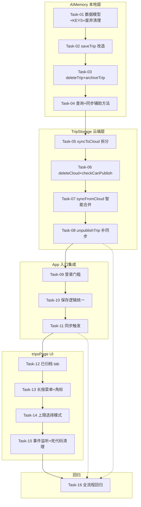

# 哇途 · 行程存储与删除联动重构 - 任务规划

> 文档版本：v1.0
> 生成时间：2026-07-08
> 阶段：✅ 任务规划（SpecForge Skill 10）
> 输入：[tech-design.md](./tech-design.md)
> 下一步：Skill 11 编码实现

---

## 0. 任务总览

共 **16 个原子任务**，分 **5 个阶段**，按依赖顺序执行。每个任务 30min-2h，单一职责，可独立验证。

**项目特殊性**：纯前端 HTML/JS/CSS 项目无单元测试框架，验证标准采用"浏览器控制台 + UI 操作"手动验证方式，每个任务给出可执行的验证命令/步骤。

### 依赖关系图



**关键依赖**：
- 阶段 1 → 阶段 2：TripStorage.syncFromCloud 调用 AIMemory 的新方法，必须先完成阶段 1
- 阶段 2 → 阶段 3：App 调用 TripStorage.syncFromCloud，必须先完成阶段 2
- 阶段 3 → 阶段 4：tripsPage UI 需要 App 层事件总线就绪
- 阶段 4 → 阶段 5：回归测试需要全部功能就绪

---

## 阶段 1：AIMemory 本地层改造

### Task-01：数据模型字段补齐 + KEYS 扩展 + 废弃代码清理

**通俗解释**：完成后，行程对象会有"待同步/归档时间"等新字段，旧的回收站代码被移除，为后续功能腾出干净的地基。

**预计工时**：45min
**依赖**：无
**涉及 AC**：AC-9, AC-10（数据基础）

**改造位置**：[js/ai-memory.js](file:///c:/Users/20180/Desktop/trip/trip/js/ai-memory.js)

**实现要点**：
1. `KEYS` 新增 `PENDING_DELETES: 'trip_pending_deletes'` 和 `LAST_SYNC_AT: 'trip_last_sync_at'`（第 2-10 行）
2. 移除 `KEYS.TRIP_TRASH`（第 6 行）—— 废弃 key，停止读写
3. 移除 `permanentDeleteTrip`（第 128-132 行）、`restoreTrip`（第 134-145 行）、`getTrash`（第 147-151 行）三个方法
4. 移除 `unarchiveTrip` 旧实现（第 153-160 行）—— 将在 Task-03 重写
5. 不主动清除 localStorage 中已有的 `trip_trash` 数据（避免误删用户历史）

**验证标准**：
- 浏览器控制台执行 `Object.keys(AIMemory.KEYS)` 包含 `PENDING_DELETES` 和 `LAST_SYNC_AT`，不包含 `TRIP_TRASH`
- 控制台执行 `typeof AIMemory.permanentDeleteTrip` 返回 `'undefined'`
- 控制台执行 `typeof AIMemory.restoreTrip` 返回 `'undefined'`
- 控制台执行 `typeof AIMemory.getTrash` 返回 `'undefined'`
- 页面加载无 JS 报错（其他模块未引用已移除方法）

---

### Task-02：saveTrip 改造（20 条上限 + 返回对象 + pendingSync）

**通俗解释**：完成后，新建行程时如果已有 20 条会拒绝创建并提示，保存的行程会自动带"待同步"标记等待上传云端。

**预计工时**：60min
**依赖**：Task-01
**涉及 AC**：AC-1, AC-2, AC-9

**改造位置**：[js/ai-memory.js:85-98](file:///c:/Users/20180/Desktop/trip/trip/js/ai-memory.js#L85) `saveTrip` 方法

**实现要点**：
1. 上限检查：`if (isNew)` 时计算 `activeCount = Object.values(trips).filter(t => !t.archivedAt).length`，≥20 返回 `{success: false, error: 'LIMIT_REACHED', id: null}`
2. 字段补齐：`trip.updatedAt = new Date().toISOString()`、`trip.pendingSync = true`、`if (!trip.archivedAt) trip.archivedAt = null`
3. 返回值改为对象 `{success: true, id, error: ''}`
4. 移除原"自动删除最旧"逻辑（第 92-95 行 `keys.length > 50` 块）
5. 新增 `_notifyCloudSync(trip)` 私有方法：检查 `typeof TripStorage !== 'undefined' && typeof Auth !== 'undefined'`，已登录则异步调 `TripStorage.syncToCloud`，成功后回调 `AIMemory.markSynced`（Task-04 实现，此处先留 TODO 注释）

**验证标准**：
- 控制台执行：先清空 `localStorage.removeItem('trip_history')`，然后循环 `AIMemory.saveTrip({title:'test'})` 20 次应全部返回 `{success:true}`，第 21 次返回 `{success:false, error:'LIMIT_REACHED'}`
- 控制台执行 `const r = AIMemory.saveTrip({title:'x'}); console.log(r)` 输出对象格式而非字符串 id
- 控制台执行 `const t = AIMemory.getTrip(AIMemory.saveTrip({title:'y'})); console.log(t.pendingSync, t.updatedAt, t.archivedAt)` 输出 `true, '2026-07-08T...', null`
- 归档行程不计入上限：先 `AIMemory.archiveTrip(id)`（Task-03 实现）后，第 21 次创建应成功

---

### Task-03：deleteTrip 补 pendingDelete + 新增 archiveTrip / unarchiveTrip

**通俗解释**：完成后，删除行程时如果网络断了会记住"待补删"，下次联网自动删云端；归档行程会从主列表移到归档列表，取消归档能回来。

**预计工时**：75min
**依赖**：Task-02
**涉及 AC**：AC-3, AC-4, AC-9, AC-10

**改造位置**：
- [js/ai-memory.js:110-126](file:///c:/Users/20180/Desktop/trip/trip/js/ai-memory.js#L110) `deleteTrip` 方法
- 新增 `archiveTrip` / `unarchiveTrip` 方法（替换 Task-01 移除的旧 `unarchiveTrip`）

**实现要点**：

1. **deleteTrip 改造**：
   - 保持本地硬删逻辑（第 116-117 行）
   - 云端删除改为 `await` + 3s 超时（`Promise.race`）
   - 失败时调 `_addPendingDelete(cloudId, id)` 记录
   - 注意：`await` 不阻塞 UI（本地已同步删，列表已移除）

2. **`_addPendingDelete(cloudId, localId)` 私有方法**：
   ```javascript
   _addPendingDelete(cloudId, localId) {
     const list = this.getPendingDeletes();
     if (list.length >= 50) list.shift(); // 上限 50 条
     list.push({ cloudId, localId, deletedAt: Date.now() });
     localStorage.setItem(this.KEYS.PENDING_DELETES, JSON.stringify(list));
   }
   ```

3. **archiveTrip(id)**：
   - 设置 `trips[id].archivedAt = Date.now()`
   - 设置 `trips[id].updatedAt = new Date().toISOString()`
   - `pendingSync = false`（归档不同步云端，见 ADR-1）
   - 触发 `EventBus.emit('trip:archived', {id})`

4. **unarchiveTrip(id)**：
   - 检查 20 条上限：`activeCount = Object.values(trips).filter(t => !t.archivedAt && t.id !== id).length`，≥20 返回 `{success:false, error:'LIMIT_REACHED'}`
   - 设置 `trips[id].archivedAt = null`
   - 触发 `EventBus.emit('trip:unarchived', {id})`

**验证标准**：
- 删除未同步行程：`AIMemory.deleteTrip('trip_xxx')`（无 cloudId）立即返回 `{success:true}`，localStorage 中该 id 消失
- 删除已同步行程（模拟离线）：临时断网后 `AIMemory.deleteTrip(id)` 返回 `{success:true}`，`localStorage.getItem('trip_pending_deletes')` 包含该 cloudId
- 归档：`AIMemory.archiveTrip(id)` 后 `AIMemory.getActiveTrips()`（Task-04）不包含该 id，`AIMemory.getArchivedTrips()`（Task-04）包含
- 取消归档上限：已有 20 条 active 时 `AIMemory.unarchiveTrip(archivedId)` 返回 `{success:false, error:'LIMIT_REACHED'}`
- 事件触发：监听 `EventBus.on('trip:archived', e => console.log(e))`，归档后输出事件

---

### Task-04：新增查询方法 + 同步辅助方法

**通俗解释**：完成后，其他模块可以方便地拿到"未归档行程/已归档行程/待同步行程"列表，云端同步后能回写 cloudId 和清除待同步标记。

**预计工时**：60min
**依赖**：Task-03
**涉及 AC**：AC-1, AC-8, AC-8b, AC-9, AC-10

**改造位置**：[js/ai-memory.js](file:///c:/Users/20180/Desktop/trip/trip/js/ai-memory.js) 新增方法

**实现要点**：

1. **查询方法**：
   - `getActiveTrips()`：返回未归档行程数组，按 savedAt 降序
   - `getArchivedTrips()`：返回已归档行程数组，按 archivedAt 降序
   - `getPendingSyncTrips()`：返回 pendingSync=true 的行程数组
   - `getActiveCount()`：返回未归档行程数量
   - `getPendingDeletes()`：返回 `trip_pending_deletes` 数组
   - `clearPendingDeletes()`：清空 `trip_pending_deletes`

2. **同步辅助方法**（供 TripStorage.syncFromCloud 调用）：
   - `applyCloudTrip(cloudTrip)`：云端行程写入本地（保留本地 archivedAt），设置 `pendingSync=false`
   - `updateCloudId(localId, cloudId, updatedAt)`：为本地行程补 cloudId，更新 updatedAt，设置 `pendingSync=false`
   - `markSynced(tripId, cloudId, updatedAt)`：同步成功后标记，设置 `pendingSync=false`，写入 cloudId 和 updatedAt
   - `updateTripStatus(cloudId, status)`：更新本地行程 status（下架时调用）
   - `setLastSyncAt(ts)`：记录上次同步时间到 `LAST_SYNC_AT`
   - `getLastSyncAt()`：读取上次同步时间

3. **补全 Task-02 的 `_notifyCloudSync(trip)`**：移除 TODO 注释，实际调用 `TripStorage.syncToCloud`，成功调 `markSynced`，失败保留 `pendingSync=true`

**验证标准**：
- `AIMemory.getActiveTrips()` 返回数组，长度 = `AIMemory.getActiveCount()`
- `AIMemory.getArchivedTrips()` 返回数组，与 active 互补（并集 = 全部行程）
- `AIMemory.getPendingSyncTrips()` 返回 pendingSync=true 的行程
- `AIMemory.applyCloudTrip({id:'cloud_xxx', cloudId:'cloud_xxx', title:'云端行程', dayPlans:[], updatedAt:'2026-07-08T10:00:00Z', status:'private'})` 后，`AIMemory.getTrip('cloud_xxx')` 存在且 `pendingSync=false`
- `AIMemory.updateCloudId('trip_local', 'cloud_abc', '2026-07-08T10:00:00Z')` 后，本地 trip_local 的 cloudId='cloud_abc'，pendingSync=false
- `AIMemory.setLastSyncAt(Date.now())` 后 `AIMemory.getLastSyncAt()` 返回非空

---

## 阶段 2：TripStorage 云端层改造

### Task-05：saveTrip 拆分为 syncToCloud + 移除本地缓存方法

**通俗解释**：完成后，云端模块只管云端的事，不再重复写本地数据，职责清晰。

**预计工时**：60min
**依赖**：Task-04（AIMemory 已就绪承接本地缓存）
**涉及 AC**：AC-1, AC-9

**改造位置**：[shared/trip-storage.js:89-156](file:///c:/Users/20180/Desktop/trip/trip/shared/trip-storage.js#L89) `saveTrip` 方法

**实现要点**：
1. `saveTrip` 重命名为 `syncToCloud(trip, userId)`，移除 `isNew` 参数和配额检查（配额已移至 AIMemory）
2. 移除 `_updateLocalCache(trip)` 调用（第 125, 147 行）
3. 移除降级到 `_saveLocal` 的逻辑（第 141, 154 行）—— 本地已由 AIMemory 处理
4. 保留 upsert 逻辑：有 cloudId 走 update，无 cloudId 走 insert
5. 返回值改为 `{success, id, updatedAt, synced, error}`
6. 移除 `_saveLocal` / `_updateLocalCache` / `_getLocalTrip` / `_getAllLocalTrips` / `_deleteLocalTrip` 五个本地缓存方法（第 545-595 行）—— 本地缓存归 AIMemory 统一管理
7. 移除 `TRIP_CACHE_KEY` 常量（第 16 行）

**验证标准**：
- 控制台执行 `typeof TripStorage.syncToCloud` 返回 `'function'`
- 控制台执行 `typeof TripStorage.saveTrip` 返回 `'undefined'`
- 控制台执行 `typeof TripStorage._saveLocal` 返回 `'undefined'`
- 控制台执行 `typeof TripStorage._updateLocalCache` 返回 `'undefined'`
- 已登录状态下 `TripStorage.syncToCloud(trip, user.id)` 返回 `{success:true, id:'uuid', updatedAt:'...', synced:true}`
- 断网状态下返回 `{success:false, error:'...', synced:false}`，不抛异常

---

### Task-06：deleteTrip 改 deleteCloud + 新增 checkCanPublish

**通俗解释**：完成后，删除云端行程的方法名字更清晰，发布到社区前能检查是否超过 10 条上限。

**预计工时**：45min
**依赖**：Task-05
**涉及 AC**：AC-3, AC-4, AC-6

**改造位置**：
- [shared/trip-storage.js:208-220](file:///c:/Users/20180/Desktop/trip/trip/shared/trip-storage.js#L208) `deleteTrip` 方法
- 新增 `checkCanPublish` 方法

**实现要点**：

1. **`deleteTrip` 重命名为 `deleteCloud(cloudId, localId)`**：
   - 移除 `_deleteLocalTrip(localId)` 调用（第 217 行）—— 本地已由 AIMemory 处理
   - 失败时抛错（让 AIMemory 记 pendingDelete）
   - 保留 `EventBus.emit('trip:deleted', {cloudId, localId})`

2. **新增 `checkCanPublish(userId)`**：
   ```javascript
   async checkCanPublish(userId) {
     if (!supabase || !userId) return { allowed: false, reason: '未登录' };
     if (typeof Auth !== 'undefined' && Auth.isAdmin()) {
       return { allowed: true, publishedCount: 0, limit: 999 };
     }
     const { count } = await supabase
       .from('trip_templates')
       .select('id', { count: 'exact', head: true })
       .eq('author_id', userId)
       .eq('status', 'published');
     const publishedCount = count || 0;
     if (publishedCount >= 10) {
       return { allowed: false, reason: '社区发布上限 10 条，请先下架或删除已发布行程', publishedCount, limit: 10 };
     }
     return { allowed: true, publishedCount, limit: 10 };
   }
   ```

3. **移除 `checkCanCreate` 和 `getQuotaInfo`**（第 34-77 行）—— 旧配额制废弃，本地 20 条由 AIMemory 检查，发布 10 条由 checkCanPublish 检查

**验证标准**：
- `typeof TripStorage.deleteCloud` 返回 `'function'`，`typeof TripStorage.deleteTrip` 返回 `'undefined'`
- `typeof TripStorage.checkCanPublish` 返回 `'function'`
- `typeof TripStorage.checkCanCreate` 返回 `'undefined'`，`typeof TripStorage.getQuotaInfo` 返回 `'undefined'`
- 已登录用户发布 0 条时 `TripStorage.checkCanPublish(userId)` 返回 `{allowed:true, publishedCount:0, limit:10}`
- 模拟已发布 10 条（数据库直接插入）后返回 `{allowed:false, reason:'社区发布上限...', publishedCount:10, limit:10}`
- `TripStorage.deleteCloud('uuid', 'local_id')` 删除成功返回 `{success:true}`，云端记录消失

---

### Task-07：新增 syncFromCloud 智能合并算法

**通俗解释**：完成后，用户换设备登录时，云端和本地的行程会自动合并，按修改时间取最新，不丢数据。

**预计工时**：120min
**依赖**：Task-06
**涉及 AC**：AC-8, AC-8b, AC-9

**改造位置**：[shared/trip-storage.js](file:///c:/Users/20180/Desktop/trip/trip/shared/trip-storage.js) 新增 `syncFromCloud` 方法

**实现要点**：严格按 [tech-design.md 4.2 节](./tech-design.md) 的伪代码实现：
1. 拉取云端 `getUserTrips(userId)` + 本地 `AIMemory.getAllTrips()`
2. 处理 `pendingDeletes`：云端有对应记录则删除，完成后 `clearPendingDeletes`
3. 智能合并遍历：按 cloudId 匹配，按 updatedAt 取新，保留本地 archivedAt
4. 本地独有（无 cloudId）上传云端
5. 批量处理 `pendingSync` 行程
6. 完成后 `AIMemory.setLastSyncAt(Date.now())` + `EventBus.emit('trip:synced', {merged, uploaded})`

**边界处理**：
- 网络中断：try-catch 包裹整个流程，已合并部分保留，未处理部分下次重试
- 云端返回空：localOnly 全部上传
- 本地为空：cloudTrips 全部 `applyCloudTrip`

**验证标准**：
- **场景 1（新设备）**：设备 B 本地无行程，登录后 `TripStorage.syncFromCloud(userId)` 返回 `{merged: N, uploaded: 0}`，本地出现 N 条行程
- **场景 2（本地独有上传）**：本地有 1 条无 cloudId 的行程，云端 0 条，同步后返回 `{merged:0, uploaded:1}`，本地该行程获得 cloudId，pendingSync=false
- **场景 3（冲突取新）**：本地行程 updatedAt='2026-07-08T10:00:00Z'，云端同 cloudId updatedAt='2026-07-08T11:00:00Z'，同步后本地内容被云端覆盖
- **场景 4（pendingDelete）**：本地 pending_deletes 含 cloudId='abc'，云端有该行程，同步后云端删除，pending_deletes 清空
- **场景 5（归档保留）**：本地行程已归档（archivedAt 有值），云端更新覆盖时本地 archivedAt 保留不丢

---

### Task-08：unpublishTrip 补本地状态同步

**通俗解释**：完成后，下架行程时本地状态也会立即改为"已下架"，UI 能马上反映变化。

**预计工时**：30min
**依赖**：Task-07
**涉及 AC**：AC-5

**改造位置**：[shared/trip-storage.js:261-275](file:///c:/Users/20180/Desktop/trip/trip/shared/trip-storage.js#L261) `unpublishTrip` 方法

**实现要点**：
1. 保留现有云端 `update({status:'private'})` 逻辑
2. 新增：成功后调 `AIMemory.updateTripStatus(cloudId, 'private')`
3. 保留 `EventBus.emit('trip:unpublished', {cloudId, userId})`

**验证标准**：
- 已发布行程下架后，`AIMemory.getTrip(localId).status === 'private'`
- 云端 `trip_templates.status === 'private'`
- `EventBus.on('trip:unpublished', e => console.log(e))` 监听到事件
- 社区列表（瀑布流）中该行程消失（依赖现有社区查询逻辑）

---

## 阶段 3：App 入口集成

### Task-09：navigateTo('plan') 加登录门槛

**通俗解释**：完成后，未登录用户点"新建行程"会被拦住弹登录窗，登录后才能创建。

**预计工时**：45min
**依赖**：Task-08
**涉及 AC**：AC-7

**改造位置**：[js/app.js](file:///c:/Users/20180/Desktop/trip/trip/js/app.js) `navigateTo` 方法

**实现要点**：
1. 找到 `navigateTo(page)` 方法（搜索 `navigateTo(` 定位）
2. 在方法开头加判断：`if (page === 'plan' && typeof Auth !== 'undefined')` 
3. 调用 `const ok = await Auth.requireAuth()`，`if (!ok) return`
4. 将 `navigateTo` 改为 `async navigateTo(page)`（如原本非 async）
5. 检查所有调用 `App.navigateTo('plan')` 的地方是否需要 `await`（按钮 onclick 可不 await，事件内部处理）

**验证标准**：
- 未登录状态点击首页"新建行程"/"AI 规划"按钮，弹出登录弹窗（Auth 已有 UI）
- 点登录弹窗的"取消"，停留在首页，不进入规划页
- 登录成功后，自动进入规划页（或保持原操作）
- 已登录状态点击"新建行程"直接进入规划页，无弹窗
- `switchTab('trips')` 未登录时不拦截，显示空列表（Task-12 处理空状态）

---

### Task-10：保存逻辑统一为只调 AIMemory + 20 条上限弹窗

**通俗解释**：完成后，保存行程时只调一个地方（AIMemory），如果满了 20 条会弹窗让用户选删哪个或归档哪个。

**预计工时**：75min
**依赖**：Task-09
**涉及 AC**：AC-1, AC-2

**改造位置**：
- [js/app.js:1089-1105](file:///c:/Users/20180/Desktop/trip/trip/js/app.js#L1089) AI 规划后保存逻辑
- 其他 `AIMemory.saveTrip` + `TripStorage.saveTrip` 并行调用处

**实现要点**：

1. **统一保存逻辑**：
   - 移除 [app.js:1089-1105](file:///c:/Users/20180/Desktop/trip/trip/js/app.js#L1089) 中直接调 `TripStorage.saveTrip` 的代码块
   - 改为只调 `const result = AIMemory.saveTrip(trip)`
   - `AIMemory.saveTrip` 内部已通过 `_notifyCloudSync` 异步触发云端同步

2. **20 条上限弹窗**：
   - 检查 `result.success === false && result.error === 'LIMIT_REACHED'`
   - 弹 `UiKit.actionSheet`（如无此组件用 `UiKit.confirm` 替代）：
     ```javascript
     const choice = await UiKit.actionSheet({
       title: '已达 20 条上限，请先处理',
       actions: [
         { text: '删除一个旧行程', value: 'delete' },
         { text: '归档一个旧行程', value: 'archive' },
         { text: '取消', value: 'cancel' },
       ]
     });
     ```
   - `delete`/`archive` 跳转到 tripsPage 并进入选择模式（Task-14 实现 UI）
   - 处理完后再调 `AIMemory.saveTrip(trip)` 重试

3. **检查其他保存点**：搜索 `AIMemory.saveTrip` 所有调用处，统一改为接收返回对象判断

**验证标准**：
- 已登录 + 未达上限：AI 规划完成后行程保存成功，本地立即出现，几秒后云端同步（控制台网络面板可见 supabase 请求）
- 已登录 + 达上限（预先插入 20 条）：保存时弹出选择面板，有"删除/归档/取消"三个选项
- 选"取消"后行程不保存，返回规划页
- 已登录状态下 `App` 不再直接调用 `TripStorage.saveTrip`（控制台执行 `grep -r "TripStorage.saveTrip" js/app.js` 无结果）

---

### Task-11：登录成功 / online 事件触发 syncFromCloud

**通俗解释**：完成后，用户登录后或断网恢复后，本地待同步的行程会自动上传云端。

**预计工时**：45min
**依赖**：Task-10
**涉及 AC**：AC-8, AC-9

**改造位置**：[js/app.js](file:///c:/Users/20180/Desktop/trip/trip/js/app.js) `onAuthChanged` 方法 + `init` 方法

**实现要点**：

1. **登录成功触发同步**：
   - 在 `onAuthChanged` 的 `if (event === 'SIGNED_IN' || event === 'INITIAL_SESSION')` 分支（第 131 行附近）加：
     ```javascript
     if (typeof TripStorage !== 'undefined' && user) {
       TripStorage.syncFromCloud(user.id).then(r => {
         if (r.merged > 0 || r.uploaded > 0) {
           UiKit.toast(`已同步 ${r.merged + r.uploaded} 条行程`, 'success');
         }
       }).catch(e => console.warn('[App] 同步失败:', e?.message));
     }
     ```

2. **online 事件触发同步**：
   - 在 `init` 方法加：
     ```javascript
     window.addEventListener('online', () => {
       if (typeof Auth !== 'undefined' && Auth.isLoggedIn()) {
         const user = Auth.getCurrentUser();
         if (user && typeof TripStorage !== 'undefined') {
           TripStorage.syncFromCloud(user.id).catch(e => console.warn(e?.message));
         }
       }
     });
     ```

3. **保留现有 `StorageMigrate.checkAndMigrate` 调用**（第 135 行）—— 迁移逻辑独立，不冲突

**验证标准**：
- 设备 A 创建 1 条行程后，设备 B 登录同账号，自动 Toast"已同步 1 条行程"，本地出现该行程
- 断网状态下创建行程（pendingSync=true），恢复网络后自动上传，Toast 提示，角标消失
- 未登录状态下断网恢复不触发同步（无报错）
- 控制台无未捕获异常

---

## 阶段 4：tripsPage UI 适配

### Task-12：新增"已归档" tab + 滑动切换适配

**通俗解释**：完成后，行程列表顶部多一个"已归档"标签，点进去能看到已归档的行程，4 个 tab 能滑动切换。

**预计工时**：90min
**依赖**：Task-11
**涉及 AC**：AC-10

**改造位置**：
- [index.html:175-198](file:///c:/Users/20180/Desktop/trip/trip/index.html#L175) tripsPage 的 tab 结构
- [js/pages.js](file:///c:/Users/20180/Desktop/trip/trip/js/pages.js) tripsPage 渲染逻辑（搜索 `trip-tabs` / `switchTripTab` 定位）
- [css/pages.css:668-842](file:///c:/Users/20180/Desktop/trip/trip/css/pages.css#L668) tripsPage 样式

**实现要点**：

1. **HTML 结构**：在 [index.html](file:///c:/Users/20180/Desktop/trip/trip/index.html#L175) 的 `.trip-tabs` 内新增第 4 个 tab 按钮 + 第 4 个 `.trip-pane`
   ```html
   <button class="trip-tab" data-tab="archived" onclick="App.switchTripTab('archived')">已归档</button>
   ```
   + 对应 `.trip-pane[data-tab="archived"]`

2. **JS 渲染**：
   - `switchTripTab(tab)` 方法适配 4 个 tab（原 3 个）
   - `archived` tab 渲染 `AIMemory.getArchivedTrips()` 而非 `getActiveTrips()`
   - 滑动切换指示器宽度从 33.3% 改为 25%
   - 归档 tab 内卡片不显示"开始/结束行程"按钮，显示"取消归档"按钮

3. **CSS 适配**：
   - `.trip-tab-indicator` 宽度 25%，`transform: translateX(tabIndex * 100%)`
   - `.trip-swipe-track` 宽度 400%（4 个 pane）
   - 归档卡片样式：灰度处理，archivedAt 显示为"归档于 YYYY-MM-DD"

**验证标准**：
- tripsPage 顶部显示 4 个 tab："待出发 / 进行中 / 已完成 / 已归档"
- 点击"已归档"tab，切换到归档列表，显示已归档行程
- 滑动切换：从"待出发"向左滑 3 次能到"已归档"
- 归档 tab 内卡片有"取消归档"按钮，点击后卡片移回主列表
- 无归档行程时显示空状态（"暂无已归档行程"）

---

### Task-13：长按菜单加"归档"项 + 渲染 pendingSync 角标

**通俗解释**：完成后，长按行程卡片除了删除还能选归档，离线创建的行程卡片上有"待同步"标记。

**预计工时**：60min
**依赖**：Task-12
**涉及 AC**：AC-9, AC-10

**改造位置**：
- [js/pages.js](file:///c:/Users/20180/Desktop/trip/trip/js/pages.js) 长按删除逻辑（搜索 `longpress` / `500ms` 定位）
- [js/pages.js](file:///c:/Users/20180/Desktop/trip/trip/js/pages.js) 行程卡片渲染函数（搜索 `formatTripCard` / `tc-header` 定位）

**实现要点**：

1. **长按菜单改为 ActionSheet**：
   - 原长按 500ms 直接弹删除确认，改为长按后弹 `UiKit.actionSheet`：
     ```javascript
     const choice = await UiKit.actionSheet({
       title: trip.title,
       actions: [
         { text: '归档此行程', value: 'archive' },
         { text: '删除此行程', value: 'delete', danger: true },
         { text: '取消', value: 'cancel' },
       ]
     });
     if (choice === 'archive') { await AIMemory.archiveTrip(id); this.renderTripCards(); }
     if (choice === 'delete') { /* 原删除确认流程 */ }
     ```
   - "已归档"tab 内长按只显示"取消归档"和"删除"
   - 保留长按视觉反馈（缩放+透明度）和振动

2. **pendingSync 角标**：
   - 在 `formatTripCard` 的 `.tc-header` 内，如 `trip.pendingSync === true` 插入：
     ```html
     <span class="tc-sync-badge">⏳ 待同步</span>
     ```
   - CSS 新增 `.tc-sync-badge`：小号灰色标签，绝对定位右上角

**验证标准**：
- 长按行程卡片（500ms）弹出 ActionSheet，有"归档/删除/取消"选项
- 选"归档"后卡片从主列表消失，切到"已归档"tab 能看到
- 选"删除"后走原删除确认流程
- 离线创建的行程卡片右上角显示"⏳ 待同步"灰色角标
- 同步成功后（联网）角标消失，无需手动刷新

---

### Task-14：20 条上限选择模式 UI

**通俗解释**：完成后，达到 20 条上限时弹出的"删除一个/归档一个"能进入选择模式，选中行程后执行对应操作。

**预计工时**：75min
**依赖**：Task-13
**涉及 AC**：AC-2

**改造位置**：
- [js/pages.js](file:///c:/Users/20180/Desktop/trip/trip/js/pages.js) tripsPage 模块
- [js/app.js](file:///c:/Users/20180/Desktop/trip/trip/js/app.js) Task-10 的上限弹窗逻辑

**实现要点**：

1. **tripsPage 新增选择模式状态**：
   ```javascript
   TripsModule.state.selectMode = null; // null | 'delete' | 'archive'
   ```

2. **进入选择模式**：
   - 接收 Task-10 弹窗的 `delete`/`archive` 选择
   - `App.navigateTo('trips')` 跳到行程页
   - `TripsModule.enterSelectMode('delete' | 'archive')`
   - 顶部显示提示条："选择要删除的行程" / "选择要归档的行程" + 取消按钮
   - 所有行程卡片进入可选中状态（右上角出现空心圆圈）

3. **选中执行**：
   - 点击卡片选中（圆圈变橙实心），再点取消
   - 选中后底部出现"确认删除"/"确认归档"按钮
   - 确认后调 `AIMemory.deleteTrip(id)` 或 `AIMemory.archiveTrip(id)`
   - 退出选择模式，返回规划页继续创建

4. **取消选择模式**：
   - 点顶部"取消"或物理返回，退出选择模式，不执行操作

**验证标准**：
- 已有 20 条行程时，点"新建行程"弹出选择面板
- 选"删除一个"后跳到行程页，顶部显示"选择要删除的行程"+ 取消按钮
- 点击某个卡片选中（右上角圆圈变实心），底部出现"确认删除"按钮
- 点"确认删除"后该行程被删除，返回规划页，新行程创建成功（此时 20 条）
- 选"归档一个"流程类似，归档后行程进"已归档"tab
- 点"取消"退出选择模式，不删除/归档任何行程

---

### Task-15：事件监听刷新 + 移除 pages.js 回收站死代码

**通俗解释**：完成后，同步完成/归档/取消归档等事件能自动刷新列表，旧的回收站相关代码全部清理干净。

**预计工时**：45min
**依赖**：Task-14
**涉及 AC**：AC-8, AC-9, AC-10

**改造位置**：
- [js/pages.js](file:///c:/Users/20180/Desktop/trip/trip/js/pages.js) TripsModule 初始化逻辑
- [js/pages.js](file:///c:/Users/20180/Desktop/trip/trip/js/pages.js) 搜索 `restoreFromTrash` / `permanentDelete` / `toggleTrash` / `formatTrashCard` 定位死代码

**实现要点**：

1. **事件监听**（在 TripsModule.init 或 renderTripCards 中绑定一次）：
   ```javascript
   EventBus.on('trip:synced', () => this.renderTripCards());
   EventBus.on('trip:archived', () => this.renderTripCards());
   EventBus.on('trip:unarchived', () => this.renderTripCards());
   EventBus.on('trip:deleted', () => this.renderTripCards());
   EventBus.on('trip:unpublished', () => this.renderTripCards());
   ```

2. **移除死代码**：
   - 搜索 `restoreFromTrash` 方法，删除
   - 搜索 `permanentDelete` 方法，删除
   - 搜索 `toggleTrash` 方法，删除
   - 搜索 `formatTrashCard` 方法，删除
   - 搜索所有调用上述方法的地方，删除调用

**验证标准**：
- 换设备同步完成后（trip:synced 事件），tripsPage 列表自动刷新，无需手动下拉
- 归档/取消归档后列表自动刷新
- 控制台执行 `grep -E "restoreFromTrash|permanentDelete|toggleTrash|formatTrashCard" js/pages.js` 无结果
- 页面加载无 "function is not defined" 报错

---

## 阶段 5：回归验证

### Task-16：全流程回归验证（11 个 AC 逐条验证）

**通俗解释**：完成后，所有功能都按需求文档描述正常工作，可以交付。

**预计工时**：120min
**依赖**：Task-15 + 所有前置任务
**涉及 AC**：AC-1 ~ AC-10 全部

**改造位置**：无代码改造，纯验证任务

**实现要点**：按 [spec.md](./spec.md) 第 4 节的 11 个 AC 逐条手动验证，每条 AC 给出验证步骤和预期结果。

**验证清单**：

#### AC-1：本地创建行程（已登录，未达上限）
1. 登录账号，清空 localStorage 中 `trip_history`
2. 点击"AI 规划"，输入目的地，生成行程，保存
3. **预期**：localStorage 出现新行程；几秒后云端有对应记录（Supabase Dashboard 查看）；行程带 cloudId；列表立即显示

#### AC-2：本地创建行程（达到上限）
1. 预先插入 20 条行程到 localStorage（控制台循环 `AIMemory.saveTrip({title:'test'+i})`）
2. 点击"新建行程"
3. **预期**：弹出选择面板"已达 20 条上限"，有"删除/归档/取消"
4. 选"归档一个"，选中某行程归档，返回规划页创建成功
5. 选"删除一个"，选中某行程删除，返回规划页创建成功
6. 选"取消"，不创建

#### AC-3：删除未发布行程
1. 创建一条未发布行程（status=private）
2. 长按卡片，选"删除"，确认
3. **预期**：localStorage 删除；云端删除（Dashboard 查看）；列表立即移除；Toast"已删除"

#### AC-4：删除已发布行程（核心修复）
1. 创建行程并发布到社区（status=published）
2. 用另一账号收藏该行程
3. 切回原账号，长按删除，确认
4. **预期**：本地+云端删除；社区列表不再显示；另一账号的收藏列表中该行程消失（刷新后）；Toast"已删除"

#### AC-5：下架已发布行程
1. 创建并发布行程
2. 在行程详情页点"下架"
3. **预期**：云端 status→private；社区不显示；别人收藏消失；自己"我的行程"仍可见，标记"已下架"；Toast"已下架，仅自己可见"
4. 点"重新发布"，行程重新出现在社区

#### AC-6：发布到社区达上限
1. 预先发布 10 条行程（数据库直接插入 status=published）
2. 尝试发布第 11 条
3. **预期**：阻止发布；提示"社区发布上限 10 条，请先下架或删除已发布行程"；引导到"我的发布"

#### AC-7：未登录访问创建入口
1. 未登录状态
2. 点击"新建行程"/"AI 规划"/"手动规划"
3. **预期**：拦截跳转；弹出登录引导弹窗"登录后即可创建行程"；有"去登录"按钮；登录成功后继续原操作

#### AC-8：换设备登录同步（本地无数据）
1. 设备 A 登录创建 15 条行程（5 条已发布）
2. 设备 B（无 localStorage 数据）登录同账号
3. **预期**：自动从云端拉取 15 条；按 updatedAt 合并；元数据同步；不弹确认框；Toast"已同步 15 条行程"

#### AC-8b：换设备登录同步（本地已有数据）
1. 设备 A 有 15 条行程
2. 设备 B 本地有 8 条（3 条与设备 A 重叠，云端更新）
3. 设备 B 登录
4. **预期**：本地 8 条保留；重叠 3 条按 updatedAt 取新；不重叠 10 条新增到本地；本地多出的 5 条上传云端；最终本地和云端一致

#### AC-9：离线创建行程
1. 登录后断网（浏览器 DevTools Network → Offline）
2. 创建并保存行程
3. **预期**：仅存本地，pendingSync=true；卡片显示"⏳ 待同步"角标
4. 恢复网络
5. **预期**：自动上传；pendingSync→false；角标消失

#### AC-10：归档行程
1. 有一条进行中或已完成行程
2. 长按卡片选"归档"
3. **预期**：从主列表移除；进入"已归档"tab；归档不计入 20 条上限
4. 在"已归档"tab 点"取消归档"
5. **预期**：回到主列表；如已达 20 条上限则提示无法取消归档

**验证标准**：
- 11 个 AC 全部通过
- 控制台无 JS 报错
- 网络面板无 4xx/5xx 错误（除模拟离线场景）
- Supabase Dashboard 数据符合预期

**回归不通过处理**：
- 记录失败的 AC 和具体现象
- 用 SpecForge Skill 13（bugfix-workflow）走 BUG 修复流程
- 修复后重新验证该 AC

---

## 附录 A：技术债务记录

开发过程中如遇以下情况，记录到本节：
- 为赶进度做的临时妥协（如某处用 setTimeout 代替事件监听）
- 未完成但有 TODO 标记的功能
- 性能待优化的地方
- 后期需重构的代码

格式：
```
### DEBT-XXX：[简短描述]
- 位置：[文件:行号]
- 现状：[当前怎么做的]
- 问题：[为什么是债务]
- 计划：[何时/如何修复]
```

---

## 附录 B：任务执行约定

1. **执行顺序**：严格按 Task-01 → Task-16 顺序，不跳过依赖
2. **每个任务完成标志**：
   - 代码改造完成
   - 验证标准全部通过
   - 更新本文件勾选对应任务
   - 如产生技术债务，记录到附录 A
3. **遇阻处理**：如某任务无法完成，记录原因，不强行推进后续任务
4. **代码风格**：遵循 [specs/开发规范.md](../开发规范.md)（如存在）
5. **提交规范**：每个任务一个 commit，格式 `feat(storage): Task-XX 简述` 或 `fix(storage): Task-XX 简述`

---

## 任务进度跟踪

- [x] Task-01：数据模型字段补齐 + KEYS 扩展 + 废弃代码清理
- [x] Task-02：saveTrip 改造（20 条上限 + 返回对象 + pendingSync）
- [x] Task-03：deleteTrip 补 pendingDelete + 新增 archiveTrip / unarchiveTrip
- [x] Task-04：新增查询方法 + 同步辅助方法
- [x] Task-05：saveTrip 拆分为 syncToCloud + 移除本地缓存方法
- [x] Task-06：deleteTrip 改 deleteCloud + 新增 checkCanPublish
- [x] Task-07：新增 syncFromCloud 智能合并算法
- [x] Task-08：unpublishTrip 补本地状态同步
- [x] Task-09：navigateTo('plan') 加登录门槛
- [x] Task-10：保存逻辑统一为只调 AIMemory + 20 条上限弹窗
- [x] Task-11：登录成功 / online 事件触发 syncFromCloud
- [x] Task-12：新增"已归档" tab + 滑动切换适配
- [x] Task-13：长按菜单加"归档"项 + 渲染 pendingSync 角标
- [x] Task-14：20 条上限选择模式 UI
- [x] Task-15：事件监听刷新 + 移除 pages.js 回收站死代码
- [x] Task-16：全流程回归验证（11 个 AC 逐条验证）
