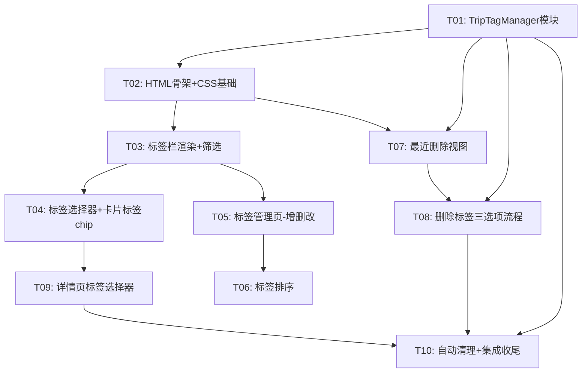

# 行程标签分类 - 任务规划

> 文档版本：v1.0
> 生成时间：2026-07-09
> 阶段：任务规划完成 / 待编码实现
> 工作流：SpecForge 功能级 - Skill 10

---

## 任务依赖图

---

## 第 1 阶段：数据层 + UI 骨架

### Task-01：TripTagManager 模块 [60min]

**目标**：创建 `js/trip-tag-manager.js`，实现标签 CRUD、行程-标签关联、最近删除的完整数据层。

**文件**：`js/trip-tag-manager.js`（新增）、`index.html`（引入脚本）

**实现内容**：
- `TripTagManager` 对象，挂载到 `window`
- 标签 CRUD：`getAllTags()`、`getTag(id)`、`createTag(name)`、`renameTag(id, name)`、`deleteTag(id)`、`reorderTags(tagIds)`
- 行程-标签关联：`setTripTag(tripId, tagId)`、`getTripsByTag(tagId)`、`getUntaggedTrips()`
- 最近删除：`getDeletedTrips()`、`moveToDeleted(tripId, tagId)`、`restoreTrip(tripId)`、`restoreAll()`、`permanentlyDelete(tripId)`、`permanentlyDeleteAll()`、`cleanupExpired()`、`getDaysRemaining(deletedAt)`
- localStorage key：`trip_tags`、`trip_recently_deleted`
- 在 `index.html` 中 `` 引入（放在 `pages.js` 之前）

**通俗解释**：完成后，标签的增删改查、给行程打标签、最近删除的数据操作都能用了，但还没有界面。

**验证标准**：
- 浏览器控制台执行 `TripTagManager.createTag('测试标签')` 返回包含 id/name/createdAt/order 的对象
- `TripTagManager.getAllTags()` 返回包含刚创建的标签数组
- `localStorage.getItem('trip_tags')` 可看到 JSON 数据
- `TripTagManager.createTag('第二个')` 后，`getAllTags().length === 2`，order 递增
- `TripTagManager.renameTag(id, '新名字')` 后 `getTag(id).name === '新名字'`
- `TripTagManager.deleteTag(id)` 后标签从 `getAllTags()` 消失

---

### Task-02：HTML 骨架 + CSS 基础样式 [50min]

**目标**：在 `index.html` 中添加标签栏容器和标签管理页的 HTML 骨架，在 `css/pages.css` 中添加基础样式。

**文件**：`index.html`（改造）、`css/pages.css`（改造）

**实现内容**：
- `#tripsPage` 内 `#tripTabs` 和 `#tripSwipe` 之间插入 `

`
- 新增 `
` 标签管理页骨架（导航栏 + 列表容器）
- CSS：标签栏样式（`.trip-tag-bar`、`.trip-tag-item`、`.trip-tag-item--active`、`.trip-tag-item--all`、`.trip-tag-item--deleted`）
- CSS：标签管理页样式（`.tag-manager-page`、`.tag-manager-list`、`.tag-manager-item`）
- CSS：标签选择面板样式（`.tag-selector-sheet`、`.tag-selector-item`、`.tag-selector-item--active`）
- CSS：行程卡片标签 chip 样式（`.tc-tag-chip`、`.tc-tag-btn`）
- CSS：最近删除卡片样式（`.deleted-trip-card`）
- CSS：标签管理页拖拽/排序按钮样式（`.tag-item-handle`、`.tag-item-edit`、`.tag-item-delete`）

**通俗解释**：完成后，页面上能看到标签栏和标签管理页的位置了，但还没有内容，样式已经就位。

**验证标准**：
- 打开行程页，tab 栏下方能看到空的标签栏区域（有高度、有背景）
- `document.getElementById('tripTagBar')` 存在
- `document.getElementById('tagManagerPage')` 存在且 `display:none`
- CSS 中存在 `.trip-tag-bar`、`.trip-tag-item`、`.tag-selector-sheet`、`.tc-tag-chip`、`.deleted-trip-card` 等类名

---

## 第 2 阶段：标签栏 + 筛选 + 打标签

### Task-03：标签栏渲染 + 标签筛选 [50min] ← 依赖 Task-01, Task-02

**目标**：实现标签栏的渲染和点击筛选功能。

**文件**：`js/pages.js`（改造 `TripsModule`）

**实现内容**：
- `TripsModule` 新增状态 `activeTagFilter: 'all'`
- `TripsModule.renderTagBar()`：渲染标签栏 HTML，`全部` → 用户标签（按 order 排序）→ `最近删除`
- `TripsModule.switchTagFilter(tagKey)`：切换筛选，重新渲染行程列表
- `TripsModule.render()` 中调用 `this.renderTagBar()`
- 改造 `renderTripCards()`：按 `activeTagFilter` 筛选行程
  - `'all'`：显示全部行程
  - `'tag_xxx'`：只显示 `trip.tagId === tagId` 的行程
  - `'deleted'`：调用 `renderDeletedTrips()`（Task-07 实现，此处先 return 空状态）
- 标签栏仅在 `currentTab === 0`（我的行程 tab）时显示，切到旅行记忆时隐藏
- `switchTripTab()` 中控制标签栏显示/隐藏
- 筛选下无行程时显示"这个分类下还没有行程"空状态

**通俗解释**：完成后，用户点击标签栏的某个标签，列表只显示该标签下的行程；点"全部"恢复显示所有行程。

**验证标准**：
- 行程页 tab 栏下方出现横向标签栏，显示"全部"（高亮）+ "最近删除"
- 控制台执行 `TripTagManager.createTag('休闲')` 后刷新页面，标签栏出现"休闲"
- 手动给某行程设置 `tagId` 后，点击"休闲"标签只显示该行程
- 点击"全部"显示所有行程
- 点击"最近删除"显示空状态提示（Task-07 完善内容）
- 切到"旅行记忆"tab，标签栏隐藏

---

### Task-04：标签选择器 + 行程卡片标签 chip [50min] ← 依赖 Task-03

**目标**：实现底部标签选择面板和行程卡片上的标签标识。

**文件**：`js/pages.js`（改造 `TripsModule` + `formatTripCard()`）

**实现内容**：
- `TripsModule.showTagSelector(tripId)`：弹出底部标签选择面板
  - 列出所有标签 + "无标签（移到全部）"选项
  - 当前选中标签高亮（✓）
  - 底部"+ 新建标签"快捷入口
  - 选择后调用 `setTripTag()` 并关闭面板
- `TripsModule.setTripTag(tripId, tagId)`：调用 `TripTagManager.setTripTag()`，触发 `trip:saved` 事件，刷新列表
- 改造 `formatTripCard()`：
  - 在 `.tc-cover-right` 内增加标签按钮（🏷 图标），点击弹出标签选择器
  - 在 `.tc-meta-row` 最前面增加标签 chip（有标签时显示标签名，无标签不显示）
- 新建标签快捷入口：点击后 `UiKit.prompt()` 输入名称 → `TripTagManager.createTag()` → 刷新选择面板

**通俗解释**：完成后，用户可以点击行程卡片上的标签按钮给行程设置标签，设置后卡片上显示标签名。

**验证标准**：
- 行程卡片封面右上角出现标签按钮（🏷）
- 点击标签按钮弹出底部面板，列出所有标签 + "无标签" + "新建标签"
- 选择一个标签后，卡片元信息行出现标签 chip，显示标签名
- 选择"无标签"后，标签 chip 消失
- 在面板中点"新建标签"，输入名称后标签列表立即出现新标签
- 点击标签 chip 也能弹出标签选择器

---

## 第 3 阶段：标签管理页

### Task-05：标签管理页 - 新建/重命名/删除 [60min] ← 依赖 Task-03

**目标**：实现标签管理页的完整 CRUD 功能（排序在 Task-06 实现）。

**文件**：`js/pages.js`（改造 `TripsModule`）、`index.html`（绑定按钮事件）

**实现内容**：
- `TripsModule.openTagManager()`：显示 `#tagManagerPage`，调用 `renderTagManager()`
- `TripsModule.closeTagManager()`：隐藏 `#tagManagerPage`，刷新标签栏
- `TripsModule.renderTagManager()`：渲染标签列表
  - 每行：拖动手柄（占位，Task-06 实现）+ 标签名 + ✏️重命名 + 🗑删除
  - 空状态："没有标签？点击右上角创建"
  - 统计每个标签下的行程数
- `TripsModule.createTagFromManager()`：`UiKit.prompt()` → `createTag()` → 刷新列表
- `TripsModule.renameTagFromManager(id)`：`UiKit.prompt()` → `renameTag()` → 刷新列表
  - 空名检查：提示"标签名不能为空"
- `TripsModule.deleteTagFromManager(id)`：三选项弹窗
  - 选项1"删除标签，保留行程"：`deleteTag()` + 行程 tagId 置 null
  - 选项2"删除标签及全部行程"：行程移入最近删除 + `deleteTag()`
  - 选项3"取消"
  - 弹窗显示标签名和旗下行程数
- 绑定 `#tagManagerBack`（返回）、`#tagManagerAddBtn`（新建）事件
- 标签栏右侧增加"管理"入口（⚙ 图标或长按标签栏），点击打开管理页

**通俗解释**：完成后，用户可以进入标签管理页面创建、重命名、删除标签了。

**验证标准**：
- 点击标签栏右侧管理入口，打开标签管理页
- 点击右上角"+"，输入名称，标签列表出现新标签
- 点击标签行的✏️，修改名称，列表和标签栏同步更新
- 点击标签行的🗑，弹出三选项弹窗，显示标签名和行程数
- 选"删除标签，保留行程"后标签消失，行程退回全部
- 选"删除标签及全部行程"后标签消失，行程从列表消失
- 点击返回关闭管理页，标签栏刷新

---

### Task-06：标签排序 [40min] ← 依赖 Task-05

**目标**：实现标签管理页的排序功能（上下箭头按钮方式，非拖拽）。

**文件**：`js/pages.js`（改造 `TripsModule.renderTagManager()`）

**实现内容**：
- `renderTagManager()` 中每个标签行增加 ↑↓ 按钮
- 第一个标签 ↑ 禁用，最后一个标签 ↓ 禁用
- 点击 ↑：与上一个标签交换 order，调用 `reorderTags()`，刷新列表
- 点击 ↓：与下一个标签交换 order，调用 `reorderTags()`，刷新列表
- `TripTagManager.reorderTags(tagIds)` 接收有序 id 数组，按顺序重新赋 order 值
- 排序后标签栏顺序同步更新

**通俗解释**：完成后，用户可以通过上下箭头调整标签的排列顺序，标签栏的顺序也跟着变。

**验证标准**：
- 标签管理页每个标签行有 ↑↓ 按钮
- 第一个标签的 ↑ 灰色不可点，最后一个标签的 ↓ 灰色不可点
- 点击 ↓ 后标签下移一位，关闭管理页后标签栏顺序对应变化
- 点击 ↑ 后标签上移一位
- 刷新页面后顺序保持

---

## 第 4 阶段：最近删除

### Task-07：最近删除视图 + 恢复/永久删除 [50min] ← 依赖 Task-01, Task-02

**目标**：实现"最近删除"标签下的完整视图和操作。

**文件**：`js/pages.js`（改造 `TripsModule`）

**实现内容**：
- `TripsModule.renderDeletedTrips()`：渲染最近删除视图
  - 顶部：标题"最近删除" + "全部恢复" + "全部删除"按钮
  - 列表：每条行程卡片显示标题、目的地、删除日期、剩余天数、恢复按钮
  - 剩余天数 = `TripTagManager.getDaysRemaining(deletedAt)`，显示"X天后永久删除"
  - 空状态："最近删除是空的"
- `TripsModule.restoreDeletedTrip(tripId)`：调用 `restoreTrip()`，刷新视图，Toast "已恢复到全部行程"
  - 检查20条上限，超限提示
- `TripsModule.restoreAllDeleted()`：调用 `restoreAll()`，刷新视图，Toast "已全部恢复"
  - 检查20条上限
- `TripsModule.permanentlyDeleteAll()`：`UiKit.confirm()` 二次确认 → `permanentlyDeleteAll()` → 刷新视图
- 完善 Task-03 中 `renderTripCards()` 对 `'deleted'` 的处理

**通俗解释**：完成后，用户点击"最近删除"能看到被删除的行程，可以恢复或永久删除。

**验证标准**：
- 点击标签栏"最近删除"，显示删除的行程列表
- 每条行程显示标题、删除日期、"X天后永久删除"
- 点击单条"恢复"按钮，行程从列表消失
- 恢复后切到"全部"，能看到恢复的行程
- 点击"全部恢复"，所有行程恢复到全部
- 点击"全部删除"，二次确认后清空
- 没有删除行程时显示"最近删除是空的"

---

## 第 5 阶段：详情页 + 集成收尾

### Task-08：删除标签完整流程 [40min] ← 依赖 Task-05, Task-07

**目标**：完善删除标签时"删除标签及全部行程"的完整流程，确保行程正确移入最近删除。

**文件**：`js/pages.js`（完善 `deleteTagFromManager`）、`js/trip-tag-manager.js`（完善 `moveToDeleted`）

**实现内容**：
- 完善 `TripTagManager.moveToDeleted(tripId, tagId)`：
  - 从 `trip_history` 读取行程，深拷贝
  - 添加 `deletedAt: Date.now()` 和保留 `tagId`
  - 存入 `trip_recently_deleted`
  - 从 `trip_history` 中删除（直接操作 localStorage，不触发云端删除）
- 完善 `deleteTagFromManager()` 选项2逻辑：
  - 找出标签下所有行程
  - 逐个 `moveToDeleted()`
  - `deleteTag()` 删除标签
  - Toast "X个行程已移入最近删除"
- 边界：标签下无行程时，选项2提示"该标签下无行程"，只删标签

**通俗解释**：完成后，删除标签时选择"删除标签及全部行程"，行程会正确进入最近删除，7天后自动清理。

**验证标准**：
- 创建标签并给2个行程打标签
- 删除标签选"删除标签及全部行程"
- 标签消失，2个行程从列表消失
- 点"最近删除"能看到这2个行程，显示"7天后永久删除"
- 恢复后行程回到"全部"且无标签
- `localStorage.getItem('trip_recently_deleted')` 可看到数据

---

### Task-09：行程详情页标签选择器 [30min] ← 依赖 Task-04

**目标**：在行程详情页的标题区域增加标签显示和选择入口。

**文件**：`js/trip-detail.js`（改造 `renderHeader()`）

**实现内容**：
- 改造 `renderHeader()`：在 `#detailSubtitle` 中增加标签选择器
  - 有标签：显示标签名（pill 样式），点击弹出标签选择器
  - 无标签：显示"设置标签"文字按钮，点击弹出标签选择器
- 标签选择器复用 `TripsModule.showTagSelector(tripId)`
- 设置标签后重新调用 `renderHeader()` 刷新显示
- `TripDetail.open()` 时确保 `renderHeader()` 能正确读取 `trip.tagId`

**通俗解释**：完成后，用户在行程详情页也能直接设置或更换标签。

**验证标准**：
- 进入行程详情页，标题下方显示当前标签名或"设置标签"
- 点击标签名/"设置标签"，弹出标签选择面板
- 选择新标签后，详情页标签名立即更新
- 返回行程列表，卡片上的标签也同步更新

---

### Task-10：自动清理 + 集成收尾 [40min] ← 依赖 Task-08, Task-09

**目标**：集成自动清理机制，处理所有边界情况，确保整体功能完整。

**文件**：`js/app.js`（改造 `init()`）、`js/pages.js`（收尾）

**实现内容**：
- `App.init()` 中调用 `TripTagManager.cleanupExpired()`，清理超过7天的删除行程
- `App.init()` 中调用 `TripTagManager.cleanupExpired()` 放在 `TripsModule.render()` 之前
- 边界处理：
  - 恢复行程时检查20条活跃上限，超限提示
  - 标签栏在旅行记忆 tab 下隐藏（完善 `switchTripTab()`）
  - `trip:saved` 事件触发后标签栏行程数刷新
- 新建行程时 `tagId` 默认为 `null`（确保 `AIMemory.saveTrip` 透传 `tagId`）
- 标签栏管理入口：在标签栏最右侧增加⚙管理按钮（在"最近删除"之前）

**通俗解释**：完成后，应用启动时自动清理过期的删除行程，所有边界情况都处理好了，功能完整可用。

**验证标准**：
- 控制台手动设置一条删除行程的 `deletedAt` 为8天前，刷新页面后该行程自动消失
- 活跃行程满20条时恢复行程，提示"活跃行程已达上限"
- 新建行程后查看，`trip.tagId` 为 `null` 或 `undefined`
- 切到旅行记忆 tab，标签栏隐藏
- 标签栏右侧有管理入口，点击进入标签管理页
- 在详情页设置标签后返回列表，卡片标签同步更新

---

## AC 覆盖汇总

| AC 编号 | 覆盖任务 |
|---------|---------|
| AC-标签-1（查看标签分类） | Task-03 |
| AC-标签-2（全部视图） | Task-03 |
| AC-标签-3（设置标签） | Task-04 |
| AC-标签-4（换标签） | Task-04 + Task-09 |
| AC-标签-5（新建标签） | Task-05 |
| AC-标签-6（重命名标签） | Task-05 |
| AC-标签-7（拖动排序） | Task-06 |
| AC-标签-8（删除标签保留行程） | Task-05 + Task-08 |
| AC-标签-9（删除标签及行程） | Task-08 |
| AC-标签-10（单条恢复） | Task-07 |
| AC-标签-11（全部恢复） | Task-07 |
| AC-标签-12（7天自动清理） | Task-10 |
| AC-标签-13（剩余天数显示） | Task-07 |

---

## 技术债务记录

| 债务 | 任务 | 说明 |
|------|------|------|
| 排序用上下箭头替代拖拽 | Task-06 | 原生 JS 拖拽排序复杂度高，MVP 用箭头按钮，后续可迭代为拖拽 |
| 标签选择面板自建弹窗 | Task-04 | 需选中态高亮+新建入口，不能直接用 showActionSheet |
| 云端同步标签 | 不在本期范围 | MVP tagId 只存本地，后续 Supabase 迁移时加字段 |

---

> 下一步：进入编码实现（SpecForge 功能级 - Skill 11），从 Task-01 开始
